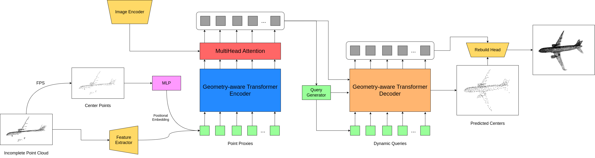
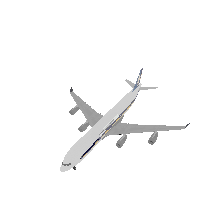
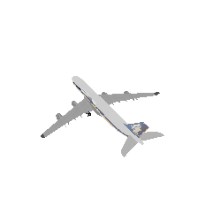
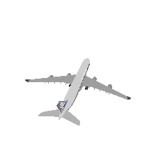

# ImgAdaPoinTr: Improving Point Cloud Completion via Images and Segmentation

This repository contains implementation for "ImgAdaPoinTr: Improving Point Cloud Completion via Images and Segmentation". In following repository we provide a brief description of the method and the results.

## Pipeline



An extended pipeline scheme. Input partial point cloud is first downsampled to derive center points. Local features
around these center points are extracted using a lightweight DGCNN. Simultaneously, the Image Encoder processes the visual
data to extract image features. These features are fused with the local features extracted from the point cloud, incorporating
the spatial intricacies of the visual data. With the addition of positional embedding to the fused features, they are channeled
into a Geometry-aware Transformer Encoder-Decoder architecture. Through multi-head attention mechanisms, this structure
predicts point proxies for the missing regions of the point cloud. Finally, the Rebuild Head refines these point proxies,
completing the point cloud in a coarse-to-fine manner.

## Usage

### Installation

In order to install all requirements, run following command in terminal:

```bash
pip install -r requirements.txt
```

In order to build all necessary extensions, run:

```bash
bash install.sh
```

You can also build them manually by running

```bash
python setup.py build && python setup.py install
```

In corresponding directory.

### Dataset

ImgPCN dataset can be accessed via [link](https://sc.link/vbpNl).

For each object we provide 24 renders. Examples of renders:

|         |         |         |         |         |         |
|---------|---------|---------|---------|---------|---------|
|  |  |  |  |  |  |
|  |  |  |  |  |  |
|  |  |  |  |  |  |
|  |  |  |  |  |  |


## Results

| Name             | AVG    | Airplane | Cabinet | Car    | Chair  | Lamp   | Sofa   | Table  | Watercraft   | F@1%  |
|------------------|--------|----------|---------|--------|--------|--------|--------|--------|--------|-------|
| FoldingNet       | 14.310 | 9.490    | 15.800  | 12.610 | 15.550 | 16.410 | 15.970 | 13.650 | 14.99  | 0.322 |
| PCN              | 9.640  | 5.500    | 22.700  | 10.630 | 8.700  | 11.000 | 11.340 | 11.680 | 8.590  | 0.695 |
| GRNet            | 8.830  | 6.450    | 10.370  | 9.450  | 9.410  | 7.960  | 10.510 | 8.440  | 8.044  | 0.708 |
| SnowFlake        | 7.210  | 4.290    | 9.160   | 8.080  | 7.890  | 6.070  | 9.230  | 6.550  | 6.400  | -     |
| SeedFormer       | 6.740  | 3.850    | 9.050   | 8.060  | 7.060  | 5.210  | 8.850  | 6.050  | 5.850  | -     |
| AdaPoinTr        | 6.528  | 3.681    | 8.823   | 7.476  | 6.850  | 5.478  | 8.353  | 5.801  | 5.763  | 0.845 |
| SegEncAdaPoinTr  | 6.569  | *3.544   | 8.893   | ***7.404*** | 6.939  | *5.189  | 8.544  | 6.179  | 5.862  | *0.847|
| ***ImgAdaPoinTr***     | ***6.347*** | ***3.515*** | ***8.540*** | *7.425 | ***6.677*** | ***5.065*** | ***8.082*** | ***5.714*** | ***5.756*** | ***0.857*** |

*Result on the PCN dataset. We use the CD-L1 (multiplied by 1000) to compare ImgAdaPoinTr with other methods. \* Denotes the top result within its experimental group, surpassing the value in AdaPoinTr. Code for metric calculation provided [here](extensions/chamfer_dist/)*


### Ablation study

| Name                       | AVG    | Airplane | Cabinet | Car    | Chair  | Lamp   | Sofa   | Table  | Watercraft |
|----------------------------|--------|----------|---------|--------|--------|--------|--------|--------|------------|
| AdaPoinTr              | 6.528  | 3.681    | 8.823   | 7.476  | 6.850  | 5.478  | 8.353  | 5.801  | 5.763      |
| AdaPoinTrVarLoss       | 6.482  | 3.614    | 8.746   | 7.422  | 6.845  | 5.277  | 8.365  | 5.831  | 5.755      |
|                            |        |          |         |        |        |        |        |        |            |
| ImgEncAdaPoinTr (6 images) | 6.414  | 3.596    | 8.701   | 7.517  | ***6.614*** | 5.217  | 8.165  | 5.785  | 5.714 |
|  (12 images)               | 6.409  | 3.586    | 8.713   | 7.489  | 6.621  | 5.218  | 8.155  | 5.783  | ***5.709*** |
| ***ImgAdaPoinTr (our)*** (6 images)    | 6.356  | 3.520    | ***8.533*** | 7.437  | *6.690* | 5.086 | 8.105 | 5.715 | 5.762      |
|  (12 images)               | ***6.347*** | ***3.515*** | 8.540 | *7.425 | 6.677  | ***5.065***  | ***8.082***  | ***5.714*** | 5.756      |
| ImgCrossEncAdaPoinTr (6 images)  | 6.487  | 3.573    | 8.868   | 7.429  | 6.692  | 5.439  | 8.217  | 5.890  | 5.787      |
|  (12 images)               | 6.482  | 3.571    | 8.864   | 7.448  | 6.683  | 5.426  | 8.199  | 5.883  | 5.787      |
| SegCrossEncAdaPoinTr   | 6.660  | 3.610    | 8.970   | 7.529  | 6.872  | 5.567  | 8.567  | 6.256  | 5.915      |
| SegCrossDecAdaPoinTr   | 6.549  | 3.649    | 8.882   | 7.519  | *6.808 | 5.311  | 8.522  | 5.924  | 5.780      |
| SegEncAdaPoinTr        | 6.569  | *3.544  | 8.893   | ***7.404*** | 6.939  | *5.189 | 8.544  | 6.179  | 5.862      |
| SegEncDecAdaPoinTr     | 6.595  | 3.649    | 9.003   | 7.526  | 6.830  | 5.383  | 8.525  | 6.058  | 5.784      |
| TripleSegFoldNetAdaPoinTr | 6.658 | 3.722 | 8.980 | 7.561 | 7.009 | 5.329 | 8.725 | 6.079 | 5.856      |

*Result of experiments on the ImgPCN dataset. We use the CD-L1 (multiplied by 1000) to compare AdaPoinTr with our other experiments. We conducted separate evaluations: one with architectures that incorporate an image encoder and another with a segmentator. For methods incorporating an image encoder, we present two rows. In the top row, the metric is assessed using 6 random viewing points for each object from the test set. For the bottom row, the number of random viewing points is 12. \* Denotes the top result within its experimental group, surpassing the value in AdaPoinTr.*

### Completion Results on ImgPCN


### Run

To run train:

```bash
bash ./scripts/train.sh 0 --config ./cfgs/ImgPCN_models/ImgResNetEncAdaPoinTrVariableLoss.yaml  --exp_name train_ImgResNetEncAdaPoinTrVariableLoss --num_workers 16 --val_freq 1
```

To eval:


```bash
bash ./scripts/test.sh 0 --ckpts experiments/ImgResNetEncAdaPoinTrVariableLoss/ImgPCN_models/train_ImgResNetEncAdaPoinTrVariableLoss_easy/ckpt-best.pth --config ./cfgs/ImgPCN_models/ImgResNetEncAdaPoinTrVariableLoss.yaml --exp_name test
```

Test the ImgAdaPoinTr [pretrained model](https://sc.link/CZI41):

```bash
bash ./scripts/test.sh 0 --ckpts ./pretrained/ImgAdaPoinTr.pth --config ./cfgs/ImgPCN_models/ImgResNetEncAdaPoinTrVariableLoss.yaml --exp_name test
```
To run train SegEncAdaPoinTr:

```bash
bash ./scripts/train.sh 0 --config ./cfgs/SegImgPCN_models/SegEncAdaPoinTr.yaml --exp_name train  --num_workers 16 --val_freq 1 --gdanet_w ./pretrained/GDANet_best_insiou_model.pth
```

Please download [GDANet weights](https://sc.link/2GRPr) for SegEncAdaPoinTr if you want to run experiments with the segmentator. Original GDANet code can be found [here](https://github.com/mutianxu/GDANet).


## Acknowledgements

Our code is inspired by [AdaPoinTr](https://github.com/yuxumin/PoinTr) and [XMFnet](https://github.com/diegovalsesia/XMFnet).

